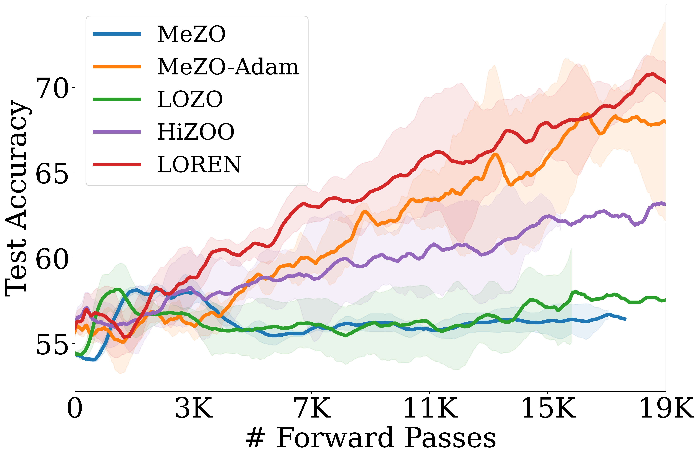
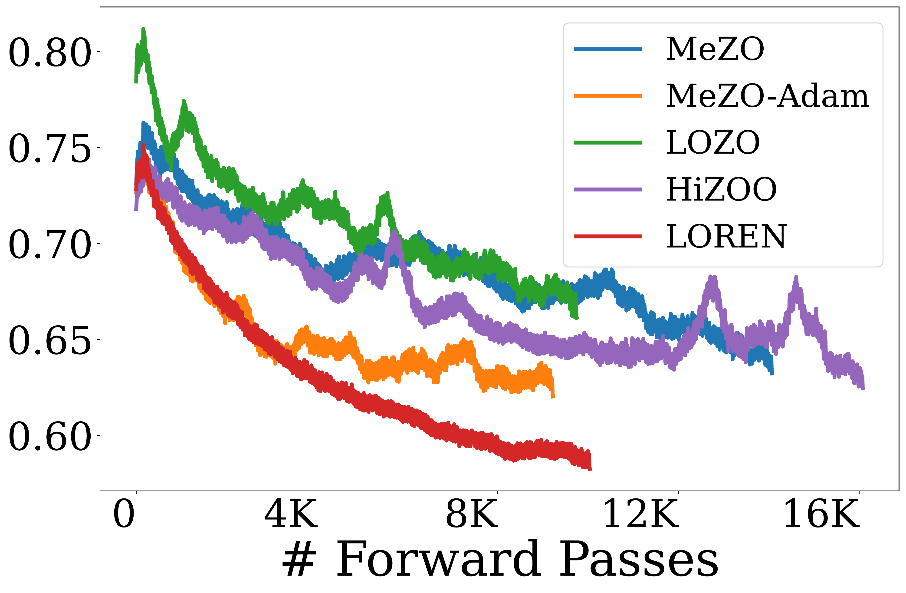
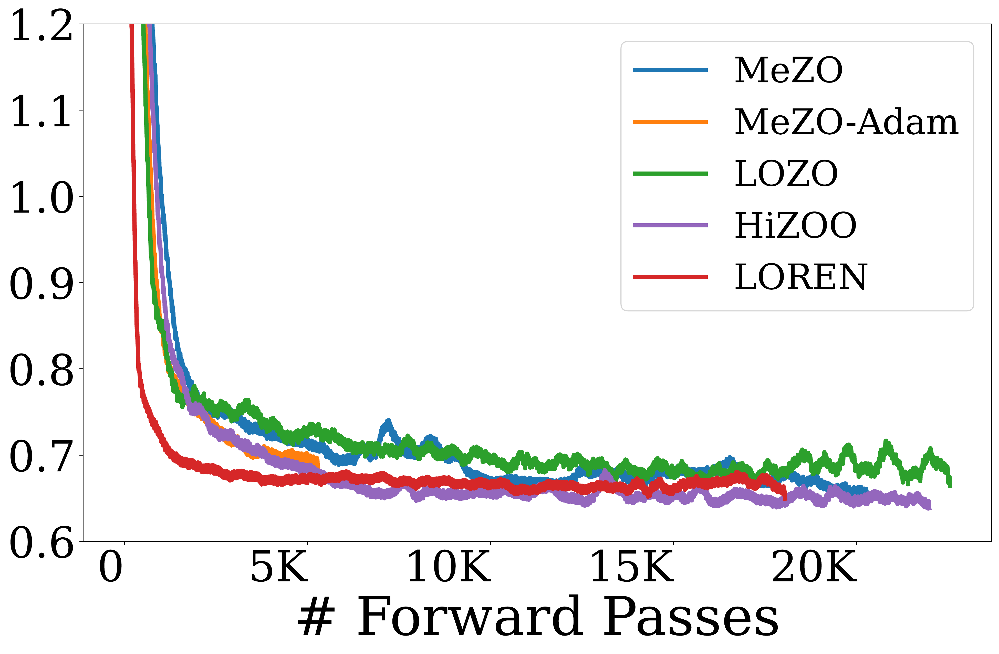
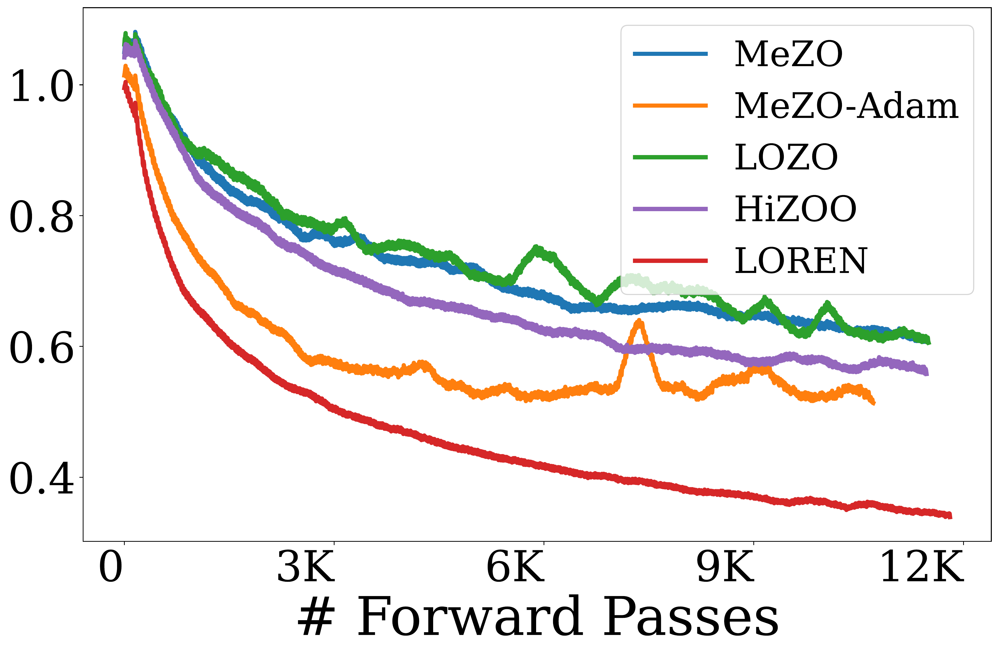

# Low-Rank Curvature for Zeroth-Order Optimization in LLM Fine-tuning

This repository provides the official implementation of **LOREN**, a curvature-aware zeroth-order (ZO) optimization 
method for efficient fine-tuning of LLMs. LOREN adaptively learns a **low-rank curvature preconditioner** and integrates 
it with REINFORCE leave-one-out (RLOO) estimator to **reduce variance**, achieving superior convergence, accuracy, and memory efficiency compared to existing ZO methods.

> Accepted at **AAAI Conference on Artificial Intelligence (AAAI-26)**, Singapore, January 2026.  
---

## Overview

LOREN reformulates preconditioned ZO optimization as *learning an anisotropic perturbation distribution* that captures 
local curvature. It combines:
- **Rank-1 block-diagonal preconditioning** to encode curvature efficiently.  
- **RLOO variance reduction** to stabilize and denoise gradient estimates.  

### Benchmark Results
<p align="center">
  
  
</p>

<p align="center">
  Figure 1: Test accuracy curves for GPT-2-XL fine-tuned on QNLI and OPT-13B fine-tuned on CB, using early stopping.
</p>

<p align="center">
  
  
  
  
</p>

<p align="center">
  Figure 2: Training loss curves for different ZO optimizers when fine-tuning OPT-13B on SuperGLUE (RTE, BoolQ, WiC, and CB) tasks.
</p>

---

## Models

| Family     | Model |
|:-----------|:--|
| DistilBERT | `distilbert-base-cased` |
| RoBERTa    | `roberta-large` |
| GPT        | `gpt2-xl` |
| OPT        | `facebook/opt-2.7b`, `facebook/opt-13b` |
| LLaMA      | `meta-llama/Meta-Llama-3-8B` |

## Tasks

**GLUE:** `mnli`, `qnli`, `sst2`, `cola`  
**SuperGLUE:** `rte`, `boolq`, `wic`, `cb`

## Algorithms
| Algorithm     | Description                                              | Reference                                                                                                                                                                                        |
|:--------------|:---------------------------------------------------------|:-------------------------------------------------------------------------------------------------------------------------------------------------------------------------------------------------|
| `ZO`          | Baseline SPSA-based ZO                                   | [Malladi et al., 2023, *Fine-Tuning Language Models with Just Forward Passes*](https://proceedings.neurips.cc/paper_files/paper/2023/file/a627810151be4d13f907ac898ff7e948-Paper-Conference.pdf) |
| `ZOAdam`      | MeZO with Adam's adaptive update                         |                                                                                                                                                                                                  |
| `ZOSVRG`      | MeZO with stochastic variance-reduced gradients          | [Gautam et al., 2024, *Variance-reduced Zeroth-Order Methods for Fine-Tuning Language Models*](https://openreview.net/pdf?id=yc758jO4i5)                                                         |
| `LOZO`        | Low-rank ZO gradient estimator                           | [Chen et al., 2025, *Enhancing Zeroth-Order Fine-Tuning for Language Models with Low-Rank Structures*](https://openreview.net/pdf?id=9BiVepgmWW)                                                 |
| `HiZOO`       | Hessian informed ZO preconditioner                       | [Zhao et al., 2025, *Second-Order Fine-Tuning without Pain for LLMs: A Hessian Informed Zeroth-Order Optimizer*](https://openreview.net/forum?id=bEqI61iBue)                                     |
| `LOREN`(ours) | Low-Rank curvature-aware ZO with RLOO variance reduction | Seung et al., 2026, *Low-Rank Curvature for Zeroth-Order Optimization in LLM Fine-Tuning*                                                                                                        |

---

## How to Run

Fine-tune a model with a chosen algorithm:

``` shell
python main.py\
    --epochs $epochs \
    --model_name $model \
    --task $task \
    --algorithm $algorithm \
    --lr $lr \
    --weight_decay 0.0 \
    --num_queries $num_queries \                    # Default: 2 (MeZO, LOZO, MeZO-Adam), 3 (MeZO-SVRG, HiZOO)
    --perturbation_scale 1e-3  \
    --lr_mezosvrg_mb 1e-6 --q 2 --anneal 5 \        # MeZO-SVRG
    --eps 1e-8 \                                    # MeZO-Adam
    --rank 2 --step_interval 50 \                   # LOZO
    --hessian_smooth_type constant1e-8 \            # HiZOO
    --lr_cov 1e-3 --damping 0.1 \                   # LOREN
    --samplesize 512 --samplesize_validation 256 \
    --batchsize $bsz \
    --batchsize_limit $bsz_lim \
    --full_parameter \
    --max_seq_length 128 \
    --device 0 --save_every 10000000 --logging csv \
    --init_seed 42 --trial $trial \
    --early_stopping --patience 1000
```

---

## Citation 
``` 
@inproceedings{seung2026lowrank,
title={Low-Rank Curvature for Zeroth-Order Optimization in LLM Fine-tuning},
author={Seung, Hyunseok and Lee, Jaewoo and Ko, Hyunsuk},
booktitle={The Fortieth AAAI Conference on Artificial Intelligence},
year={2026},
}
``` 